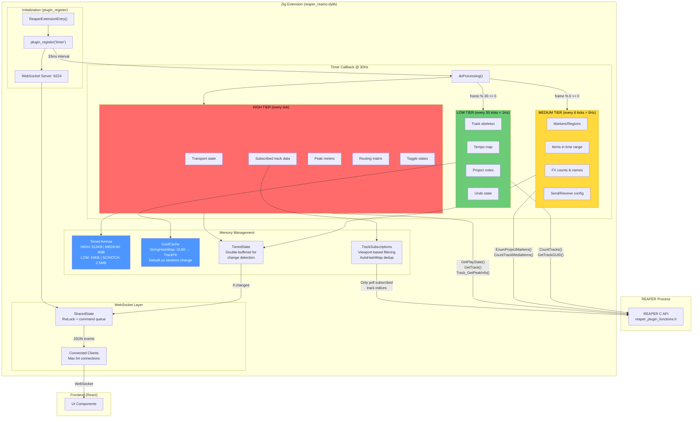
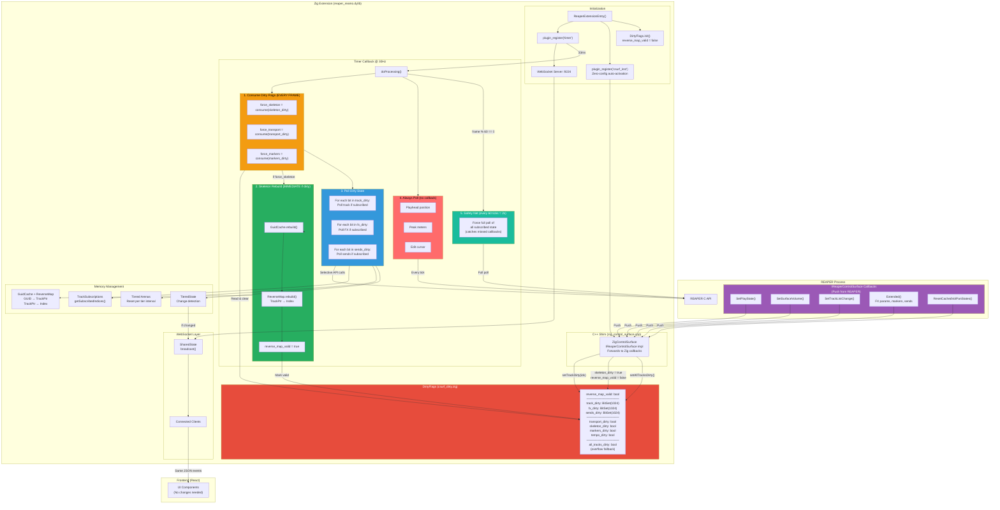

# CSurf Push-Based Architecture Migration

## Goal

Migrate from pure polling to a hybrid CSurf + polling architecture for reduced CPU overhead and instant state change notifications.

---

## Validation Status

This plan has been validated against the actual codebase and REAPER API research. Key corrections from validation:

| Claim | Corrected |
|-------|-----------|
| FrameArena 64KB | Actually dynamic: HIGH=512KB, MEDIUM=4MB, LOW=64KB, SCRATCH=2.5MB |
| BitSet for subscriptions | Actually AutoHashMap for dedup + Array slots |
| Max 8 clients | Actually MAX_CLIENTS=64 |
| Extended() return 1 | **Always return 0** per SWS best practice |
| Heartbeat 5s (150 frames) | **2s (60 frames)** per SWS battle-tested constants |
| isSubscribed(idx) needed | Not needed - getSubscribedIndices() is more efficient |

---

## Current State Architecture Diagram



**Current Performance Characteristics:**
- **CPU**: O(n) polling where n = subscribed tracks × properties
- **100 tracks**: ~3000 API calls/sec for track data alone
- **Latency**: Up to 33ms for transport, 200ms for markers, 1s for skeleton
- **Memory**: Tiered arenas (512KB-4MB per tier), zero heap allocation in hot path
- **Bandwidth**: Change detection prevents redundant broadcasts

---

## End-State Architecture Diagram



**End-State Performance Characteristics:**
- **CPU**: O(subscribed) polling with hash-based change detection (not O(changes) - see research findings below)
- **Latency**: <33ms for callback-driven changes (dirty flags force immediate broadcast)
- **Reliability**: Hash catches callback gaps (undo, selection, FX drag) - no 2s wait
- **Memory**: Same tiered arenas + 384 bytes for 3 BitSet(1024)
- **Bandwidth**: Unchanged - same JSON events, smarter broadcast decisions

---

## Current State

**3-Tier Polling Architecture:**
- HIGH (30Hz): Transport, subscribed tracks, metering, toggles, peaks, routing
- MEDIUM (5Hz): Markers, regions, items, FX counts, sends, project state
- LOW (1Hz): Tempomap, track skeleton, project notes, undo state

**CSurf Integration (already built):**
- C++ shim in `zig_control_surface.cpp` using `csurf_inst` (zero-config auto-activation)
- Zig module in `csurf.zig` with conditional compilation (`-Dcsurf=true`)
- Working: Transport, repeat, track list, tempo, FX chain, markers
- Stubbed: Track vol/pan/mute/solo/selection/recarm, FX params, sends

---

## End-State Architecture

### Core Principle: CSurf for Detection, Polling for Data

CSurf callbacks signal *what* changed via dirty flags. The main loop polls *current values* only for dirty state. This maintains:
- Single source of truth (polling)
- Existing event formats (no frontend changes)
- Fallback when CSurf disabled

### Revised Polling Strategy

| Content | Polling | Broadcast Trigger | Notes |
|---------|---------|-------------------|-------|
| Position, meters | Every frame | Always | No CSurf callback exists |
| Subscribed tracks | Every frame | Hash changed OR dirty flag | Dirty = instant latency, hash catches gaps |
| Markers, regions | 5Hz + immediate | Dirty flag OR hash changed | CSurf triggers immediate poll |
| Skeleton | Immediate on dirty | Always on change | Rebuilt before consuming track flags |
| Tempomap | 1Hz + immediate | Dirty flag | Immediate rebuild on tempo change |
| Full state | Every 60 frames | Sets all_dirty | Safety net for missed callbacks |

**Key insights:**
1. We poll ALL subscribed tracks every frame (not filtering by dirty bits)
2. Dirty flags provide **instant latency** - force broadcast even if hash unchanged
3. Hash comparison catches **callback gaps** (undo, selection, FX drag)
4. Skeleton rebuild happens **immediately**, not waiting for LOW tier

### What Must Still Poll (No Callback Exists)

- Playhead position
- Peak meters
- Edit cursor / time selection
- Undo state
- Project length

---

## Implementation Plan

### Phase 1: Dirty Flag Infrastructure

Create `extension/src/csurf_dirty.zig`:

```zig
const std = @import("std");

/// Research-backed constants from SWS Extension analysis
pub const SAFETY_POLL_INTERVAL: u32 = 60;      // 2s at 30Hz (SWS-validated)
pub const VOL_CHANGE_THRESHOLD: f64 = 0.001;   // ~0.01dB
pub const PAN_CHANGE_THRESHOLD: f64 = 0.005;   // ~0.5%

pub const DirtyFlags = struct {
    // Validity guard - false between SetTrackListChange and rebuild()
    reverse_map_valid: bool = false,

    // Per-track dirty (bitsets, max 1024 tracks)
    track_dirty: std.StaticBitSet(1024) = std.StaticBitSet(1024).initEmpty(),
    fx_dirty: std.StaticBitSet(1024) = std.StaticBitSet(1024).initEmpty(),
    sends_dirty: std.StaticBitSet(1024) = std.StaticBitSet(1024).initEmpty(),

    // Global dirty flags
    transport_dirty: bool = false,
    skeleton_dirty: bool = false,
    markers_dirty: bool = false,
    tempo_dirty: bool = false,

    // Overflow fallback (when track idx >= 1024)
    all_tracks_dirty: bool = false,

    pub fn setTrackDirty(self: *@This(), idx: usize) void {
        if (idx >= 1024) {
            self.all_tracks_dirty = true;
            return;
        }
        self.track_dirty.set(idx);
    }

    pub fn setFxDirty(self: *@This(), idx: usize) void {
        if (idx >= 1024) {
            self.all_tracks_dirty = true;
            return;
        }
        self.fx_dirty.set(idx);
    }

    pub fn setSendsDirty(self: *@This(), idx: usize) void {
        if (idx >= 1024) {
            self.all_tracks_dirty = true;
            return;
        }
        self.sends_dirty.set(idx);
    }

    pub fn consumeTrackDirty(self: *@This()) struct { bits: std.StaticBitSet(1024), all: bool } {
        const result = .{ .bits = self.track_dirty, .all = self.all_tracks_dirty };
        self.track_dirty = std.StaticBitSet(1024).initEmpty();
        self.all_tracks_dirty = false;
        return result;
    }

    pub fn consumeFxDirty(self: *@This()) struct { bits: std.StaticBitSet(1024), all: bool } {
        const result = .{ .bits = self.fx_dirty, .all = self.all_tracks_dirty };
        self.fx_dirty = std.StaticBitSet(1024).initEmpty();
        return result;
    }

    pub fn consumeSendsDirty(self: *@This()) struct { bits: std.StaticBitSet(1024), all: bool } {
        const result = .{ .bits = self.sends_dirty, .all = self.all_tracks_dirty };
        self.sends_dirty = std.StaticBitSet(1024).initEmpty();
        return result;
    }

    pub fn consumeGlobal(self: *@This(), flag: *bool) bool {
        const was = flag.*;
        flag.* = false;
        return was;
    }

    pub fn setAllTracksDirty(self: *@This()) void {
        self.all_tracks_dirty = true;
    }

    pub fn clearAll(self: *@This()) void {
        self.track_dirty = std.StaticBitSet(1024).initEmpty();
        self.fx_dirty = std.StaticBitSet(1024).initEmpty();
        self.sends_dirty = std.StaticBitSet(1024).initEmpty();
        self.transport_dirty = false;
        self.skeleton_dirty = false;
        self.markers_dirty = false;
        self.tempo_dirty = false;
        self.all_tracks_dirty = false;
        // Note: Don't clear reverse_map_valid here - only rebuild() sets it true
    }
};
```

Add `g_dirty_flags: ?*DirtyFlags` global in main.zig.

### Phase 2: Track Pointer → Index Mapping

Extend `guid_cache.zig` with reverse lookup:

```zig
pub const GuidCache = struct {
    // Existing...
    allocator: Allocator,
    map: std.StringHashMap(*anyopaque),
    generation: u32,
    master_track: ?*anyopaque,

    // NEW: track pointer -> unified index
    reverse_map: std.AutoHashMap(*anyopaque, c_int),

    pub fn init(allocator: Allocator) GuidCache {
        return .{
            .allocator = allocator,
            .map = std.StringHashMap(*anyopaque).init(allocator),
            .generation = 0,
            .master_track = null,
            .reverse_map = std.AutoHashMap(*anyopaque, c_int).init(allocator),
        };
    }

    pub fn deinit(self: *GuidCache) void {
        // Free owned GUID strings
        var key_iter = self.map.keyIterator();
        while (key_iter.next()) |key| {
            self.allocator.free(key.*);
        }
        self.map.deinit();
        self.reverse_map.deinit();  // NEW
    }

    pub fn rebuild(self: *GuidCache, api: anytype) !void {
        // Clear existing entries
        var key_iter = self.map.keyIterator();
        while (key_iter.next()) |key| {
            self.allocator.free(key.*);
        }
        self.map.clearRetainingCapacity();
        self.reverse_map.clearRetainingCapacity();  // NEW

        // Cache master track
        self.master_track = api.masterTrack();

        // Build cache from all user tracks
        const track_count = api.trackCount();
        var idx: c_int = 1;
        while (idx <= track_count) : (idx += 1) {
            const track = api.getTrackByUnifiedIdx(idx) orelse continue;
            var guid_buf: [64]u8 = undefined;
            const guid = api.formatTrackGuid(track, &guid_buf);
            if (guid.len > 0) {
                const owned_guid = try self.allocator.dupe(u8, guid);
                try self.map.put(owned_guid, track);
                try self.reverse_map.put(track, idx);  // NEW
            }
        }
        self.generation +%= 1;
    }

    /// Resolve track pointer to unified index (0 = master, 1+ = user tracks)
    pub fn resolveToIndex(self: *const GuidCache, track: *anyopaque) ?c_int {
        // Special case: master track
        if (self.master_track) |master| {
            if (track == master) return 0;
        }
        return self.reverse_map.get(track);
    }
};
```

### Phase 3: Wire CSurf Callbacks to Dirty Flags

Update `csurf.zig` callback implementations:

**ExtCode constants** (validated against reaper_csurf.h):

```zig
pub const ExtCode = struct {
    pub const RESET: c_int = 0x0001FFFF;
    pub const SETFXPARAM: c_int = 0x00010008;
    pub const SETFXPARAM_RECFX: c_int = 0x00010018;  // Input/monitoring FX
    pub const SETFXENABLED: c_int = 0x00010007;      // FX bypass toggle
    pub const SETFXCHANGE: c_int = 0x00010013;
    pub const SETPROJECTMARKERCHANGE: c_int = 0x00010014;
    pub const SETBPMANDPLAYRATE: c_int = 0x00010009;
    pub const SETSENDVOLUME: c_int = 0x00010005;
    pub const SETSENDPAN: c_int = 0x00010006;
    pub const SETRECVVOLUME: c_int = 0x00010010;
    pub const SETRECVPAN: c_int = 0x00010011;
};
```

**Callback implementations:**

```zig
/// Called when track list changes (add/remove/reorder)
/// SWS pattern: Set dirty flag, DON'T rebuild here - wait for callback burst to settle
fn setTrackListChange(ctx: ?*anyopaque) callconv(.c) void {
    _ = ctx;
    const flags = g_dirty_flags orelse return;
    flags.skeleton_dirty = true;
    flags.reverse_map_valid = false;  // Mark stale until rebuild
    // Note: SetTrackListChange triggers NumTracks+1 SetTrackTitle calls
    // The rebuild happens in doProcessing() after the burst settles
}

/// Called when track volume changes
/// Research: Called at ~30Hz during automation playback, no built-in debouncing
fn setSurfaceVolume(ctx: ?*anyopaque, track: MediaTrackHandle, vol: f64) callconv(.c) void {
    _ = ctx; _ = vol;
    const flags = g_dirty_flags orelse return;
    if (!flags.reverse_map_valid) return;  // Skip until rebuilt

    // Validate track still exists (SWS defensive pattern)
    const track_idx = resolveTrackIndex(track) orelse return;
    flags.setTrackDirty(@intCast(track_idx));
}

fn setSurfacePan(ctx: ?*anyopaque, track: MediaTrackHandle, pan: f64) callconv(.c) void {
    _ = ctx; _ = pan;
    const flags = g_dirty_flags orelse return;
    if (!flags.reverse_map_valid) return;
    const track_idx = resolveTrackIndex(track) orelse return;
    flags.setTrackDirty(@intCast(track_idx));
}

fn setSurfaceMute(ctx: ?*anyopaque, track: MediaTrackHandle, mute: bool) callconv(.c) void {
    _ = ctx; _ = mute;
    const flags = g_dirty_flags orelse return;
    if (!flags.reverse_map_valid) return;
    const track_idx = resolveTrackIndex(track) orelse return;
    flags.setTrackDirty(@intCast(track_idx));
}

fn setSurfaceSolo(ctx: ?*anyopaque, track: MediaTrackHandle, solo: bool) callconv(.c) void {
    _ = ctx; _ = solo;
    const flags = g_dirty_flags orelse return;
    if (!flags.reverse_map_valid) return;
    const track_idx = resolveTrackIndex(track) orelse return;
    flags.setTrackDirty(@intCast(track_idx));
}

fn setSurfaceSelected(ctx: ?*anyopaque, track: MediaTrackHandle, selected: bool) callconv(.c) void {
    _ = ctx; _ = selected;
    const flags = g_dirty_flags orelse return;
    if (!flags.reverse_map_valid) return;
    const track_idx = resolveTrackIndex(track) orelse return;
    flags.setTrackDirty(@intCast(track_idx));
}

fn setSurfaceRecArm(ctx: ?*anyopaque, track: MediaTrackHandle, recarm: bool) callconv(.c) void {
    _ = ctx; _ = recarm;
    const flags = g_dirty_flags orelse return;
    if (!flags.reverse_map_valid) return;
    const track_idx = resolveTrackIndex(track) orelse return;
    flags.setTrackDirty(@intCast(track_idx));
}

fn setPlayState(ctx: ?*anyopaque, play: bool, pause: bool, rec: bool) callconv(.c) void {
    _ = ctx; _ = play; _ = pause; _ = rec;
    const flags = g_dirty_flags orelse return;
    flags.transport_dirty = true;
}

/// Called after certain undo operations - invalidate everything
/// Research: Undocumented trigger conditions, treat as "nuclear option"
fn resetCachedVolPanStates(ctx: ?*anyopaque) callconv(.c) void {
    _ = ctx;
    const flags = g_dirty_flags orelse return;
    // Nuclear option: mark everything dirty
    flags.setAllTracksDirty();
    flags.transport_dirty = true;
    flags.skeleton_dirty = true;
    flags.markers_dirty = true;
    flags.tempo_dirty = true;
    // Don't set reverse_map_valid = false here - skeleton_dirty will trigger rebuild
}

/// Extended callbacks for FX, markers, sends, tempo
/// CRITICAL: Always return 0 per SWS best practice (never consume callbacks)
fn extended(ctx: ?*anyopaque, call: c_int, p1: ?*anyopaque, p2: ?*anyopaque, p3: ?*anyopaque) callconv(.c) c_int {
    _ = ctx; _ = p2; _ = p3;
    const flags = g_dirty_flags orelse return 0;

    switch (call) {
        ExtCode.SETFXPARAM, ExtCode.SETFXPARAM_RECFX => {
            // Research: 43-187 callbacks/sec per automated parameter
            // Just set dirty flag - actual polling handles debouncing
            if (!flags.reverse_map_valid) return 0;
            const track_idx = resolveTrackIndex(p1) orelse return 0;
            flags.setFxDirty(@intCast(track_idx));
            return 0;  // ALWAYS 0 - never consume
        },
        ExtCode.SETFXENABLED => {
            if (!flags.reverse_map_valid) return 0;
            const track_idx = resolveTrackIndex(p1) orelse return 0;
            flags.setFxDirty(@intCast(track_idx));
            return 0;
        },
        ExtCode.SETPROJECTMARKERCHANGE => {
            flags.markers_dirty = true;
            return 0;
        },
        ExtCode.SETBPMANDPLAYRATE => {
            flags.tempo_dirty = true;
            return 0;
        },
        ExtCode.SETSENDVOLUME, ExtCode.SETSENDPAN => {
            if (!flags.reverse_map_valid) return 0;
            const track_idx = resolveTrackIndex(p1) orelse return 0;
            flags.setSendsDirty(@intCast(track_idx));
            return 0;
        },
        ExtCode.SETRECVVOLUME, ExtCode.SETRECVPAN => {
            if (!flags.reverse_map_valid) return 0;
            const track_idx = resolveTrackIndex(p1) orelse return 0;
            flags.setSendsDirty(@intCast(track_idx));
            return 0;
        },
        ExtCode.SETFXCHANGE => {
            // FX added/removed - need skeleton refresh
            flags.skeleton_dirty = true;
            return 0;
        },
        else => return 0,
    }
}

/// Helper to resolve track pointer to index using GuidCache reverse map
fn resolveTrackIndex(track: ?*anyopaque) ?c_int {
    const t = track orelse return null;
    const cache = g_guid_cache orelse return null;
    return cache.resolveToIndex(t);
}
```

### Phase 4: Main Loop Integration

Modify `doProcessing()` in main.zig:

```zig
const csurf_dirty = @import("csurf_dirty.zig");

fn doProcessing() !void {
    // ============================================================
    // 1. CONSUME DIRTY FLAGS (every frame, before any tier logic)
    // ============================================================
    var force_transport = false;
    var force_skeleton = false;
    var force_markers = false;
    var force_tempo = false;

    if (csurf.enabled) {
        if (g_dirty_flags) |flags| {
            force_transport = flags.consumeGlobal(&flags.transport_dirty);
            force_skeleton = flags.consumeGlobal(&flags.skeleton_dirty);
            force_markers = flags.consumeGlobal(&flags.markers_dirty);
            force_tempo = flags.consumeGlobal(&flags.tempo_dirty);
        }
    }

    // ============================================================
    // 2. SKELETON REBUILD - IMMEDIATE if dirty (not tier-bound!)
    // This MUST happen before consuming track flags so reverse_map is valid
    // ============================================================
    if (force_skeleton) {
        try g_guid_cache.?.rebuild(&backend);
        if (g_dirty_flags) |flags| {
            flags.reverse_map_valid = true;  // Now safe to use
        }
        // Also trigger skeleton poll to broadcast changes
        // (or set a flag to force skeleton poll in LOW tier section)
    }

    // ============================================================
    // 3. HIGH TIER - Always poll position/meters (no callback exists)
    // Poll tracks only if dirty OR force_broadcast
    // ============================================================
    const subscribed_indices = track_subs.getSubscribedIndices(...);

    // Position/meters: always poll (no CSurf callback)
    high_state.transport = transport.State.poll(&backend);
    high_state.metering = metering.pollSubscribedInto(...);

    // Track data: ALWAYS poll all subscribed (research showed callback gaps)
    // Use hash for change detection, dirty flags for instant latency
    high_state.tracks = tracks.State.pollIndices(..., subscribed_indices);

    // Hash-based change detection (replaces fragile slice comparison)
    const current_hash = tracks.computeHash(high_state.tracks);

    // Consume dirty flags for latency optimization
    const track_dirty = if (g_dirty_flags) |flags|
        flags.consumeTrackDirty()
    else
        .{ .bits = std.StaticBitSet(1024).initEmpty(), .all = false };
    const any_dirty = track_dirty.all or track_dirty.bits.count() > 0;

    // Broadcast decision: hash changed OR dirty flag OR force_broadcast
    const hash_changed = current_hash != prev_tracks_hash;
    const should_broadcast = hash_changed or any_dirty or force_broadcast;

    // Drift logging: hash changed without dirty flag = missed callback
    if (hash_changed and !any_dirty and !force_broadcast) {
        logging.warn("Track drift without dirty flag (undo/selection?)", .{});
    }

    if (should_broadcast) {
        broadcast(...);
        prev_tracks_hash = current_hash;
    }

    // ============================================================
    // 4. MEDIUM TIER - Poll when dirty OR regular interval
    // ============================================================
    const medium_tick = (g_frame_counter % MEDIUM_TIER_INTERVAL == 0);

    if (force_markers or medium_tick) {
        // Poll and broadcast markers/regions
        const marker_state = markers.State.poll(medium_alloc, &backend);
        // ... broadcast if changed
    }

    if (force_tempo or medium_tick) {
        // Poll tempomap (moved from LOW tier for faster response)
        const tempo_state = tempomap.State.poll(&backend);
        // ... broadcast if changed
    }

    // ============================================================
    // 5. LOW TIER - Safety net polling (skeleton already handled above)
    // ============================================================
    const low_tick = (g_frame_counter % LOW_TIER_INTERVAL == 0);

    if (low_tick) {
        // Poll project notes, undo state, etc.
        // Skeleton comparison (for non-CSurf mode or safety)
    }

    // ============================================================
    // 6. HEARTBEAT SAFETY NET - Every 2 seconds
    // Catches missed callbacks, ReaScript changes, rapid undo/redo
    // ============================================================
    if (g_frame_counter % csurf_dirty.SAFETY_POLL_INTERVAL == 0) {
        // Force full comparison of all subscribed state
        // This catches any drift from missed CSurf callbacks
        if (g_dirty_flags) |flags| {
            flags.setAllTracksDirty();
        }
    }
}
```

**Critical ordering:**
1. Consume global dirty flags FIRST (every frame)
2. Skeleton rebuild IMMEDIATELY when dirty (before track flag consumption)
3. HIGH tier: Poll ALL subscribed tracks, use hash + dirty flags for broadcast decision
4. MEDIUM tier: Poll when dirty OR regular interval
5. LOW tier: Safety net polling
6. Heartbeat every 2s sets all_dirty for full validation

**Key insight (from research):** We do NOT filter polling by dirty bits. Callback gaps (undo, selection, FX drag) would cause missed updates. Instead, we poll everything and use dirty flags only for instant broadcast latency.

### Phase 5: Add ResetCachedVolPanStates to C++ Shim

**zig_control_surface.h** - add callback type:

```c
typedef void (*ZigResetCachedVolPanStatesCb)(void* ctx);

struct ZigCSurfCallbacks {
    // ... existing callbacks ...
    ZigResetCachedVolPanStatesCb reset_cached_vol_pan_states;
};
```

**zig_control_surface.cpp** - add override:

```cpp
void ResetCachedVolPanStates() override {
    if (m_cb.reset_cached_vol_pan_states)
        m_cb.reset_cached_vol_pan_states(m_cb.user_context);
}
```

---

## Files to Modify

| File | Change |
|------|--------|
| `extension/src/csurf_dirty.zig` | NEW: Dirty flag state management with bitsets |
| `extension/src/csurf.zig` | Wire callbacks to dirty flags, implement all stubbed callbacks |
| `extension/src/zig_control_surface.h` | Add reset_cached_vol_pan_states callback |
| `extension/src/zig_control_surface.cpp` | Wire ResetCachedVolPanStates virtual method |
| `extension/src/guid_cache.zig` | Add reverse_map for track pointer lookup |
| `extension/src/main.zig` | Consume dirty flags, conditional polling, heartbeat safety net |

---

## Key Design Decisions

1. **`csurf_inst` registration for zero-config activation** - Uses `plugin_register("csurf_inst", ...)` not `"csurf"`. Surface auto-activates on plugin load, never appears in Preferences, requires zero user configuration. This is the SWS Extension pattern.

2. **Keep existing event formats** - CSurf triggers polling which produces same JSON events. No frontend changes.

3. **Dirty flags, not direct broadcast** - Avoids race conditions between CSurf callbacks and main loop.

4. **2-second heartbeat safety net** (SWS-validated) - CSurf can miss events (rapid changes, ReaScript, undo). Full state comparison catches drift.

5. **Subscription filtering at poll time, not callback time** - Callbacks set dirty flags for ALL tracks unconditionally. Subscription filtering happens when consuming dirty flags during poll. This is safer since subscriptions can change between callback and poll.

6. **Graceful fallback** - When `csurf.enabled == false`, reverts to pure time-based polling.

7. **Threading model (validated)** - CSurf callbacks and timer callback both run on REAPER's main thread. WebSocket I/O runs on separate thread but only accesses SharedState through RwLock-protected broadcast(). Dirty flags are main-thread-only, no atomics needed.

8. **Reverse map validity guard** - Between SetTrackListChange and rebuild(), the reverse map is stale. Track callbacks check `reverse_map_valid` and bail early if false, preventing garbage lookups.

9. **Per-track granularity for FX/sends** - Using bitsets instead of single bools avoids full FX polls when one parameter changes. With 100 tracks × 10 FX × 20 params, this prevents 20,000 unnecessary API calls.

10. **Always return 0 from Extended()** - Per SWS best practice, never consume callbacks. Return value semantics are undocumented; defensive coding says propagate to all surfaces.

11. **Skeleton rebuild is IMMEDIATE, not tier-bound** - When skeleton_dirty is consumed, rebuild happens that frame, not waiting for LOW tier interval. This minimizes the window where track callbacks are dropped (<33ms vs up to 1s).

---

## Actual Benefits (Post-Research)

**Important:** Research (`CSURF_RESEARCH.md`) revealed that CSurf callbacks have documented gaps (undo/redo, action-based selection, FX drag between tracks). We chose **latency optimization + reliable change detection** over aggressive API call reduction.

| Benefit | Description |
|---------|-------------|
| **Latency** | <33ms response to callback-driven changes (force broadcast on dirty flag) |
| **Reliability** | Hash-based change detection catches callback gaps immediately |
| **Debugging** | Drift logging identifies missed callbacks (undo, selection, etc.) |

**What we're NOT doing:** The original plan claimed 99% API call reduction by filtering subscribed_indices by dirty bits. Research showed this is risky - callback gaps would cause missed updates.

**Actual polling behavior:**
| State | Polling Rate | Change Detection |
|-------|--------------|------------------|
| Track data | 30Hz (all subscribed) | Hash + dirty flag force |
| Markers/regions | 5Hz + immediate on dirty | Hash comparison |
| Skeleton | Immediate on dirty | Rebuilt immediately |
| Transport | 30Hz + immediate on dirty | Direct comparison |
| Position/meters | 30Hz always | No callback exists |

---

## Testing Checklist

**Core Functionality:**
- [ ] Rapid fader movement - no events lost
- [ ] Multi-track selection - batched, not per-track spam
- [ ] Project load - clean state, no stale events
- [ ] CSurf disabled (`zig build` without flag) - fallback works
- [ ] High track count (500+) - CPU savings measurable
- [ ] Tab switch - dirty flags cleared

**Race Condition Prevention:**
- [ ] Track list change during fader move - callback fires, fader move ignored (not crash), then caught on heartbeat
- [ ] 1000+ tracks project - bounds checking works, no silent drops
- [ ] Rapid undo/redo - ResetCachedVolPanStates triggers full refresh
- [ ] FX parameter automation playback - dirty flags coalesce (43-187 callbacks/s per param handled gracefully)

**SWS-Derived Patterns:**
- [ ] Extended() always returns 0
- [ ] SetTrackListChange doesn't rebuild immediately - waits for callback burst
- [ ] 2-second heartbeat catches missed callbacks

---

## Migration Path

| Phase | Description | Status |
|-------|-------------|--------|
| **Phase 1** | DirtyFlags struct in `csurf_dirty.zig` | ✅ Complete |
| **Phase 2** | reverse_map in `guid_cache.zig` | ✅ Complete |
| **Phase 3** | Wire callbacks to dirty flags in `csurf.zig` | ✅ Complete |
| **Phase 4** | Main loop integration (skeleton rebuild, heartbeat) | ✅ Complete |
| **Phase 4.5** | Global dirty flag consumption (transport/markers/tempo) | ✅ Complete |
| **Phase 4.6** | Per-track dirty flag consumption + hash-based change detection | ✅ Complete |
| **Phase 5** | ResetCachedVolPanStates callback | ✅ Complete |
| **Phase 6** | Make CSurf the default (flip `orelse false` to `orelse true`) | ✅ Complete |

CSurf is now enabled by default. Use `-Dcsurf=false` to disable during debugging.

**Phase 4.6 details:** See `docs/architecture/CSURF_PHASE4.6_HANDOVER.md` for full implementation plan and research-backed rationale.

---

## Research Findings (Phase 4.6)

External research was conducted to validate the implementation approach. Key findings:

**1. Hybrid architecture is universal**
All production CSurf implementations (MCU, HUI, SWS, CSI, ReaLearn) use callback + polling. Pure callbacks are insufficient.

**2. Documented callback gaps**
- `OnTrackSelection()` - doesn't fire for action/API-based selection
- `CSURF_EXT_SETFXCHANGE` - doesn't fire when dragging FX between tracks
- Undo/redo - no dedicated callback
- Project tab switching only triggers `SetTrackListChange()`

**3. Hash computation is negligibly cheap**
Wyhash at 30Hz = ~0.0008% CPU. Hash comparison (2ns) is 10-100x cheaper than API calls.

**4. Recommended approach**
"Callback-primary with polling safety net: trust callbacks for immediate response, process changes using dirty flags, run hash-based safety poll to catch drift."

**Decision:** We chose Option B-1 + A (hash-based detection + dirty flag force broadcast) over B-2 (dirty-flag-driven polling) because callback gaps would cause missed updates.

Full research: `CSURF_RESEARCH.md`

---

## Research References

- `research/REAPER_CSURF_API_BEHAVIOUR.md` - Authoritative callback behavior from SWS analysis
- `CSURF_RESEARCH.md` - External research on DAW control surface best practices
- SWS Extension source (`sws_extension.cpp`, `TrackList.cpp`) - 15+ years battle-tested patterns
- REAPER SDK (`reaper_plugin.h`, `reaper_csurf.h`) - Official interface definitions
